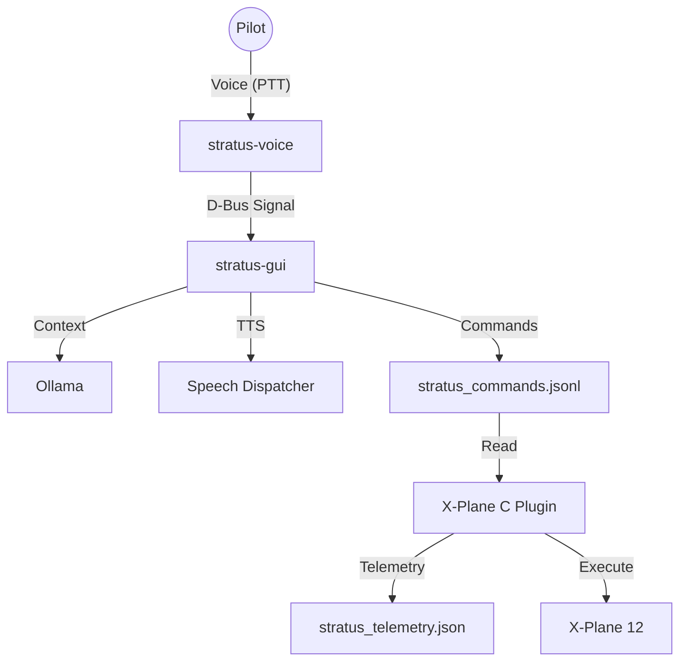

# Project Status: Stratus ATC

## ✅ Current Status: Pure Rust Rewrite (Zero Python)

**January 14, 2026** - Stratus ATC has successfully migrated to a pure Rust architecture. The legacy Python components have been archived.

### Architecture: "Rust Trio"

- **`stratus-voice` (Service)**: Handles PTT, Audio Capture, VAD, and STT (Signal Emitter).
- **`stratus-gui` (App/Brain)**: Handles UI, Telemetry, LLM Context, Command Processing, and TTS.
- **`stratus-commander` (FFI Lib)**: Embedded in the X-Plane C plugin for controlling the sim.

---

### ✅ Completed Components

#### 1. X-Plane Native Plugin (Linux)

- **Status**: Working ✅
- **Location**: `adapters/xplane/StratusATC/lin_x64/StratusATC.xpl`
- **Features**:
  - Reads DataRefs (position, radios, transponder, autopilot)
  - Writes telemetry to `~/.local/share/StratusATC/stratus_telemetry.json`
  - Reads commands from `~/.local/share/StratusATC/stratus_commands.jsonl`
  - **Zero Python**: No XPPython3 dependency.

#### 2. Voice Service (`stratus-voice`)

- **Status**: Working ✅
- **Features**:
  - `evdev` for low-latency PTT hook.
  - `webrtc-vad` for voice activity detection.
  - D-Bus integration for broadcast signaling.

#### 3. GUI Client (`stratus-gui`)

- **Status**: Working ✅
- **Tech**: Rust Iced (Cross-platform GUI).
- **Features**:
  - Real-time conversation log.
  - Ollama integration (Llama 3).
  - Telemetry display.

---

### 🚧 Next Steps

#### Refinement

- Improve command parsing robustness (Currently regex-based).
- Add config file for PTT device selection (currently hardcoded or scan-based).

---

## Architecture Diagram



---

## File Structure

```
Stratus/
├── README.md                    # Project overview
├── stratus-rs/                  # Rust Workspace
│   ├── stratus-core/            # Shared logic (Brain)
│   ├── stratus-voice/           # Voice Service
│   ├── stratus-gui/             # Iced App
│   └── stratus-commander/       # FFI Library
├── adapters/
│   └── xplane/
│       └── src/
│           └── stratus_plugin.c # C Plugin (Links stratus-commander)
├── docs/                        # Documentation
└── .legacy_client/              # Archived Python code
```

---

## Run Commands

```bash
# Run the Voice Service
cd stratus-rs && cargo run --bin stratus-voice

# Run the GUI
cd stratus-rs && cargo run --bin stratus-gui
```
